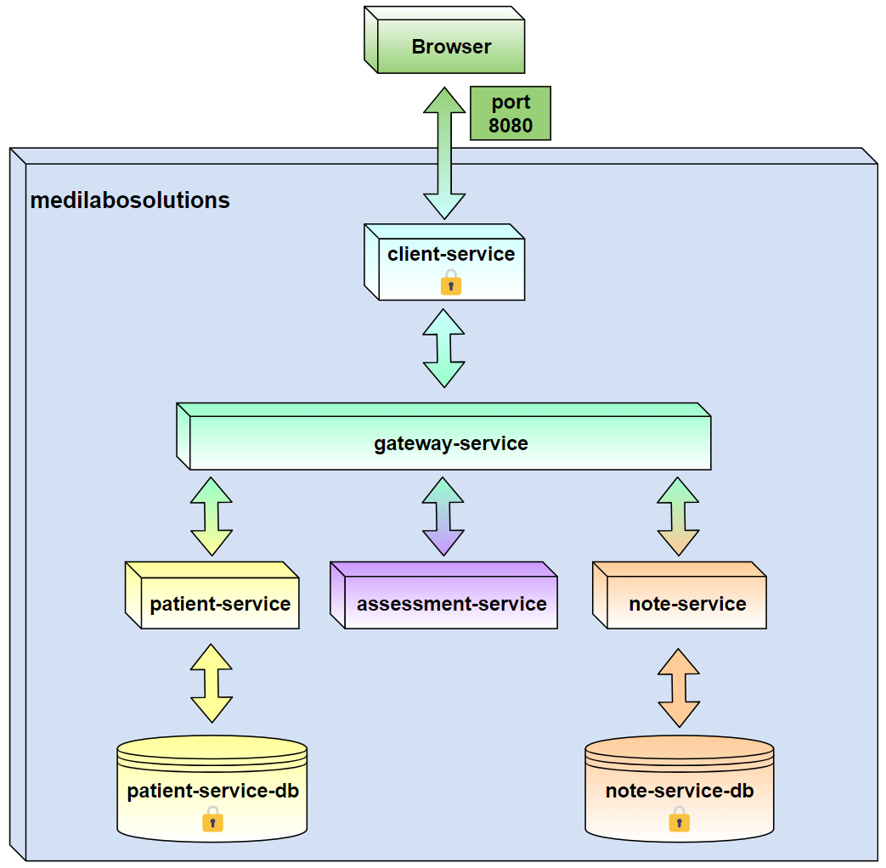
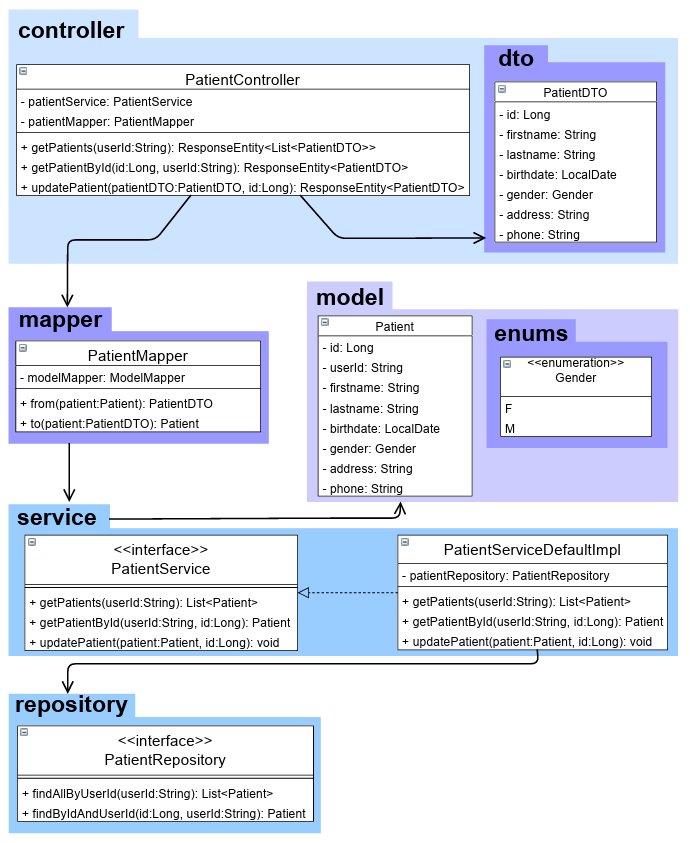
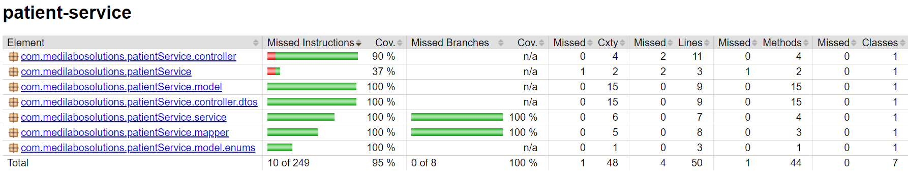
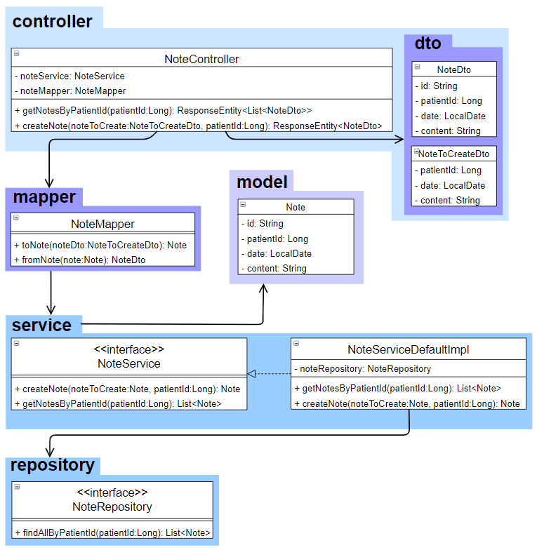
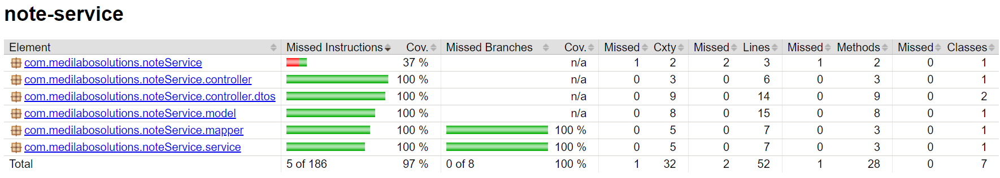
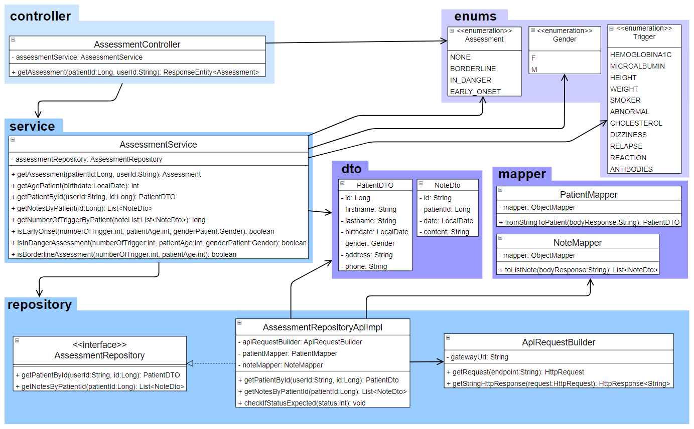
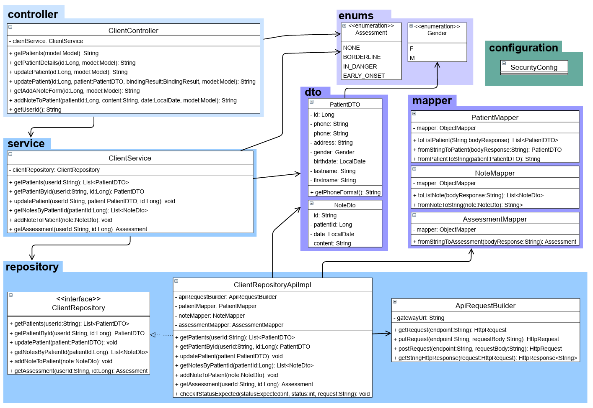
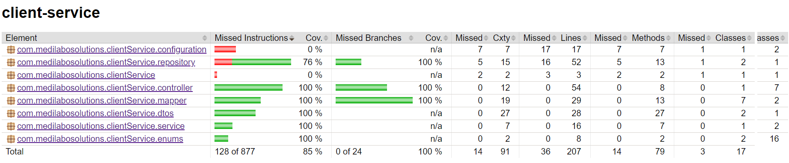

# MediLaboSolutions

Microservice Project for openclassrooms project 9 via Spring boot

It is an application to manage a list of patients, add some notes and get an assessment of risk of diabetes.

## Used By

This project is used by OpenClassRooms in attempt to validate the project 9 from the formation for learn the java technology.

## Green Code Recommandations

Although 6 of the 11 major green code practices already in place in the application such as : create a minimalist website; refactor functions and use optimized algorithms; eliminate unnecessary functions; reduce duplicate code by creating functions; use a micro-services architecture; we could improve the application by following the below recommendations :

1. Use efficient data structures adapted to the data you are going to store there :
   Instead of loading an entire patient and his attributes and all the notes and their attributes, we could retrieve only the attributes necessary for the proper processing of the assessment-service methods: PatientDTO: patientId, userId, gender, birthdate & NoteDTO: content.

2. Limit the number of HTTP/HTTPS requests to your servers :
   Instead of going through the gateway, assessment-service could retrieve data directly from patient-service and note-service by communicating via Spring Cloud OpenFeign.

3. When deploying, you should choose a certified ecological host like [Digital Forest](https://digitalforest.fr/) which offers low-carbon private Cloud servers without air conditioning, powered by renewable energies, they have an environmental charter.

## Getting Started

These instructions will get you a copy of the project up and running on your local machine for development and testing purposes.

### Prerequisites

This application was developed with the following configuration

- Java 17.0.6

- Maven 3.9.2

- Spring Boot 3.2.1

- Docker 24.0.2

### Installing

- command `git clone https://github.com/Vanessa-Roy/MediLaboSolutions.git`

- command `mvn clean package` to each microservices [ patient-service ; note-service ; gateway-service ; assessment-service ; client-service ]

- configure the `.env.docker` for the following microservices [ patient-service ; note-service ; assessment-service ; client-service ] ; You must help you with the several `.env.docker.example`

### Running App

- command `docker-compose up --build` [ `-d` if you want to skip the details ]

- command `docker-compose stop` [ to stop running the containers ]

- command `docker-compose down` [ to remove the containers ]

### docker-compose up screencast :

<video src="docker-compose-up-screecast.mp4" controls title="Title"></video>

## Documentation

### architecture:

### patient-service:

### note-service:

### assessment-service:

### client-service:

## Author

@Vanessa-Roy
